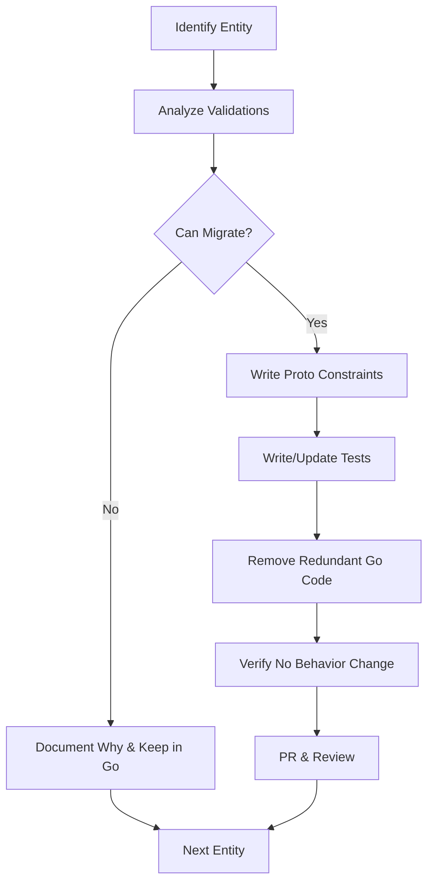

# Protovalidate Migration Plan
## Migrating Remaining Go Validations to Declarative Proto Constraints

---

## Executive Summary

**Current State**: OSAC-1275 successfully migrated metadata field validation (name, labels, annotations) from Go to protovalidate. Remaining Go validation is primarily business logic that cannot be fully expressed in proto constraints.

**Goal**: Identify and migrate additional Go validations that can be expressed declaratively in proto, while keeping necessary business logic in Go.

**Scope**: ~18 entity servers with ~50+ validation methods

---

## Phase 1: Analysis & Categorization

### 1.1 Validation Categories

Based on analysis of existing code, validations fall into these categories:

| Category | Can Migrate to Proto? | Examples | Rationale |
|----------|----------------------|----------|-----------|
| **Input Format** | ✅ Yes | SSH key format, email format, CIDR syntax | Regex patterns, CEL expressions |
| **Field Length** | ✅ Yes | Domain name max 253 chars, description max 1024 | Simple constraints |
| **Required Fields** | ✅ Yes | Spec must exist, certain fields mandatory | `min_len`, `required` |
| **Enum Validation** | ✅ Yes | Valid state values, IP family | `defined_only` |
| **Pattern Matching** | ⚠️ Partial | Label segments, DNS labels | CEL for complex patterns |
| **Immutability** | ❌ No | Fields can't change after create | Requires DB lookup |
| **Referential Integrity** | ❌ No | Pool exists, network exists | Requires DB lookup |
| **State Transitions** | ❌ No | PENDING → READY valid | Business logic |
| **Cross-Object Rules** | ❌ No | CIDR overlap, uniqueness | Requires DB queries |
| **Duplicate Detection** | ❌ No | No duplicate domains | Requires collection scan |

### 1.2 Current Validation Inventory

```bash
# Generate complete inventory
find internal/servers -name "private_*_server.go" \
  -exec grep -l "validate" {} \; | wc -l
# Result: 18 servers with validation
```

**Breakdown by Entity:**

| Entity | Validation Methods | Migratable | Complex (Keep in Go) |
|--------|-------------------|------------|---------------------|
| Tenants | 3 (domains) | 1 (format) | 2 (uniqueness, DNS) |
| BareMetalInstances | 3 (spec, catalog, template) | 1 (SSH key) | 2 (references) |
| Clusters | 3 (conditions, nodesets) | 0 | 3 (all business logic) |
| ComputeInstances | 3 (type, template, network) | 0 | 3 (immutability) |
| ExternalIPs | 4 (IP, pool, immutable, state) | 1 (format) | 3 (references, state) |
| PublicIPs | 4 (IP, pool, immutable, state) | 1 (format) | 3 (references, state) |
| SecurityGroups | 2 (spec, network ref) | 0 | 2 (references) |
| Subnets | 3 (spec, network ref, immutable) | 0 | 3 (references, immutability) |
| VirtualNetworks | 2 (spec, CIDR) | 1 (CIDR format) | 1 (overlap check) |
| NetworkClasses | 1 (spec) | 0 | 1 (business logic) |
| Others | ~20 methods | ~5 | ~15 |
| **TOTAL** | **~48 methods** | **~10 (21%)** | **~38 (79%)** |

---

## Phase 2: Migration Strategy

### 2.1 Principles

1. **Migrate only what belongs in proto**
   - Input format validation → Proto
   - Business logic → Go
   - When in doubt, keep in Go

2. **Maintain hybrid validation where needed**
   - Simple constraints in proto (length, required)
   - Complex logic in Go (references, state)

3. **No behavior changes**
   - Exact same validation rules
   - Same error messages
   - Same timing (interceptor for Create, server for Update)

4. **Incremental migration**
   - One entity at a time
   - Test thoroughly before moving to next
   - Each entity is its own PR

### 2.2 Migration Workflow



### 2.3 Testing Strategy

For each migrated validation:

1. **Unit tests** - Verify proto constraint works
2. **Integration tests** - End-to-end validation
3. **Regression tests** - Compare old vs new behavior
4. **Negative tests** - Invalid input rejected with same error

---

## Phase 3: Migration Candidates

### Priority 1: High-Value, Low-Risk (Weeks 1-2)

#### 3.1 Tenant Domains Validation

**Current (Go):**
```go
// internal/servers/private_tenants_server.go
func (s *PrivateTenantsServer) validateDomain(domain string, index int) error {
    if domain == "" { return error }
    if len(domain) > 253 { return error }
    if net.ParseIP(domain) != nil { return error }
    // ... DNS label validation
}
```

**Target (Proto):**
```protobuf
// proto/private/osac/private/v1/tenant_type.proto
message TenantSpec {
  repeated string domains = 1 [(buf.validate.field).repeated = {
    unique: true,
    items: {
      string: {
        min_len: 1,
        max_len: 253,
        pattern: "^([a-z0-9]([a-z0-9-]{0,61}[a-z0-9])?\\.)+[a-z]{2,}$"  // DNS hostname
      },
      cel: [{
        id: "not_ip_address",
        message: "domain must be a hostname, not an IP address",
        expression: "!this.matches('^[0-9.]+$') && !this.matches('^[0-9a-f:]+$')"
      }]
    }
  }];
}
```

**Effort:** 2-3 days
**Risk:** Low (no DB dependencies)
**Value:** High (better declarative spec validation)

---

#### 3.2 SSH Public Key Validation

**Current (Go):**
```go
// internal/servers/private_baremetal_instances_server.go
func validateOpenSSHPublicKey(key string) error {
    // Parse SSH key format
    _, _, _, _, err := ssh.ParseAuthorizedKey([]byte(key))
    return err
}
```

**Target (Proto):**
```protobuf
message BareMetalInstanceSpec {
  optional string ssh_public_key = 5 [(buf.validate.field).string = {
    // SSH key format: "ssh-rsa AAAA..." or "ssh-ed25519 AAAA..."
    pattern: "^(ssh-(rsa|dss|ed25519|ecdsa)|ecdsa-sha2-nistp(256|384|521)) [A-Za-z0-9+/=]+(\\s+.*)?$",
    min_len: 40,
    max_len: 8192
  }];
}
```

**Caveat:** Regex can't fully validate SSH key - can verify format but not cryptographic validity.

**Recommendation:** Hybrid approach:
- Proto: Length + basic format pattern
- Go: Keep cryptographic validation (parse with ssh library)

**Effort:** 1-2 days
**Risk:** Medium (need to keep crypto validation)
**Value:** Medium (catches most errors at proto layer)

---

#### 3.3 CIDR Format Validation

**Current (Go):**
```go
// internal/servers/private_public_ip_pools_server.go
func validatePoolCIDRFormat(cidrStr string, ipFamily privatev1.IPFamily, idx int) (string, error) {
    _, network, err := net.ParseCIDR(cidrStr)
    if err != nil { return "", error }
    // Validate IP family matches
    // Canonicalize CIDR
}
```

**Target (Proto):**
```protobuf
message PublicIPPoolSpec {
  message PoolCIDR {
    string cidr = 1 [(buf.validate.field).string = {
      // IPv4 CIDR: "10.0.0.0/24"
      // IPv6 CIDR: "2001:db8::/32"
      cel: [{
        id: "valid_cidr",
        message: "must be a valid CIDR notation (e.g., 10.0.0.0/24 or 2001:db8::/32)",
        expression: "this.matches('^([0-9]{1,3}\\.){3}[0-9]{1,3}/[0-9]{1,2}$') || this.matches('^[0-9a-f:]+/[0-9]{1,3}$')"
      }]
    }];
    
    IPFamily ip_family = 2 [(buf.validate.field).enum.defined_only = true];
  }
  
  repeated PoolCIDR cidrs = 3;
}
```

**Caveat:** CEL can't parse/canonicalize CIDR, only validate syntax.

**Recommendation:** Hybrid approach:
- Proto: Basic CIDR syntax pattern
- Go: Keep parsing, canonicalization, IP family validation

**Effort:** 2-3 days
**Risk:** Medium (complex validation logic)
**Value:** Medium (syntax errors caught early)

---

### Priority 2: Medium-Value, Medium-Risk (Weeks 3-4)

#### 3.4 Required Spec Fields

Many entities check `spec != nil` in Go - can move to proto:

```protobuf
message ComputeInstance {
  ComputeInstanceSpec spec = 3 [(buf.validate.field).required = true];
}

message ComputeInstanceSpec {
  string instance_type = 1 [(buf.validate.field).string.min_len = 1];
  // ... other required fields
}
```

**Entities to update:**
- BareMetalInstances
- ComputeInstances  
- Clusters
- Subnets
- SecurityGroups
- VirtualNetworks

**Effort:** 1 week (batch update)
**Risk:** Low (simple constraints)
**Value:** Medium (cleaner code, better errors)

---

#### 3.5 Enum Validation

Ensure only defined enum values accepted:

```protobuf
enum IPFamily {
  IP_FAMILY_UNSPECIFIED = 0;
  IP_FAMILY_IPV4 = 1;
  IP_FAMILY_IPV6 = 2;
}

message PublicIPPoolSpec {
  IPFamily default_ip_family = 2 [(buf.validate.field).enum = {
    defined_only: true,
    not_in: [0]  // Reject UNSPECIFIED
  }];
}
```

**Effort:** 3-4 days
**Risk:** Low
**Value:** High (prevents invalid enum values)

---

### Priority 3: Complex Validations (Keep in Go)

These CANNOT be migrated to proto - document and keep in Go:

#### 3.6 Immutability Checks

**Why keep in Go:** Requires comparing with DB state

```go
// KEEP THIS - Cannot express in proto
func validateImmutableFieldsSubnet(new, existing *Subnet) error {
    if existing == nil { return nil }
    if new.Spec.VirtualNetwork != existing.Spec.VirtualNetwork {
        return error("virtual_network is immutable")
    }
}
```

**Affected entities:**
- Subnets, SecurityGroups, ExternalIPs, PublicIPs, InstanceTypes, ComputeInstances

---

#### 3.7 Referential Integrity

**Why keep in Go:** Requires DB lookup

```go
// KEEP THIS - Cannot express in proto
func (s *Server) validatePoolReference(ctx context.Context, poolID string) error {
    _, err := s.poolsDAO.Get().SetId(poolID).Do(ctx)
    if err != nil { return error("pool not found") }
}
```

**Affected entities:**
- All entities with foreign key references

---

#### 3.8 Cross-Object Business Rules

**Why keep in Go:** Requires querying multiple objects

```go
// KEEP THIS - Cannot express in proto
func (s *Server) validateNoPoolCIDROverlap(ctx, newPool) error {
    existingPools := s.poolsDAO.List() // Query all pools
    // Check for CIDR overlaps
}
```

**Affected entities:**
- IP pools (overlap detection)
- Tenants (domain uniqueness across tenants)
- NetworkClasses (CIDR overlap)

---

## Phase 4: Implementation Plan

### Week 1-2: Foundation
- [ ] Update documentation (AGENTS.md, API.md) with migration guidelines
- [ ] Create migration template for entities
- [ ] Set up validation testing framework
- [ ] **Deliverable:** Tenant domains migration (PR #1)

### Week 3-4: High-Value Validations
- [ ] SSH key validation (BareMetalInstances)
- [ ] CIDR format validation (IP pools)
- [ ] **Deliverable:** 2-3 entity PRs

### Week 5-6: Required Fields & Enums
- [ ] Batch update: required spec fields
- [ ] Batch update: enum validation
- [ ] **Deliverable:** 1 PR with multiple entities

### Week 7-8: Documentation & Cleanup
- [ ] Document all "keep in Go" validations with rationale
- [ ] Update all entity server comments
- [ ] Create validation architecture doc
- [ ] **Deliverable:** Documentation PR

---

## Phase 5: Success Criteria

### Metrics

- [ ] **Coverage**: 80%+ of migratable validations moved to proto
- [ ] **Tests**: Every migrated validation has integration test
- [ ] **Documentation**: Clear comments on why each validation is in proto vs Go
- [ ] **No regressions**: All existing tests pass
- [ ] **Error quality**: Error messages as good or better than before

### Quality Gates

1. **Before migration**: Document current validation behavior
2. **During migration**: Write proto constraints + tests
3. **After migration**: Verify exact same behavior
4. **PR review**: Architecture team approval

---

## Phase 6: Risks & Mitigations

| Risk | Impact | Mitigation |
|------|--------|------------|
| Proto constraints less expressive than Go | High | Keep complex validation in Go (hybrid) |
| Error messages less helpful | Medium | Use custom CEL error messages |
| Performance impact of CEL evaluation | Low | Benchmark critical paths |
| Breaking existing clients | High | Ensure exact same validation behavior |
| Over-migration (moving business logic) | Medium | Clear categorization guidelines |

---

## Appendix A: Decision Tree

```
Is this validation about:
├─ Input format/syntax?
│  ├─ Can express in regex? → Proto (pattern)
│  ├─ Needs CEL logic? → Proto (CEL)
│  └─ Needs parsing library? → Hybrid (proto + Go)
│
├─ Field constraints?
│  ├─ Length, required, range? → Proto (standard constraints)
│  └─ Enum values? → Proto (defined_only)
│
├─ Business logic?
│  ├─ Needs DB lookup? → Go
│  ├─ Immutability? → Go
│  ├─ State transitions? → Go
│  └─ Cross-object rules? → Go
│
└─ When in doubt → Keep in Go
```

---

## Appendix B: Template PR Checklist

When migrating validation for an entity:

- [ ] Analyze all validation methods for the entity
- [ ] Categorize: migratable vs keep in Go
- [ ] Write proto constraints for migratable validations
- [ ] Add unit tests for proto constraints
- [ ] Add integration tests for end-to-end validation
- [ ] Remove redundant Go code (keep business logic!)
- [ ] Update entity server comments
- [ ] Verify error messages are equivalent
- [ ] Run full test suite
- [ ] Document rationale in PR description

---

## Appendix C: Example Migration

**Before:**
```go
// internal/servers/private_tenants_server.go
func (s *Server) validateDomain(domain string, idx int) error {
    if domain == "" {
        return grpcstatus.Errorf(grpccodes.InvalidArgument,
            "field 'spec.domains[%d]' must not be empty", idx)
    }
    if len(domain) > 253 {
        return grpcstatus.Errorf(grpccodes.InvalidArgument,
            "field 'spec.domains[%d]' must be at most 253 characters", idx)
    }
    // ... more validation
}
```

**After:**
```protobuf
// proto/private/osac/private/v1/tenant_type.proto
message TenantSpec {
  repeated string domains = 1 [(buf.validate.field).repeated = {
    unique: true,
    items: {
      string: {
        min_len: 1,
        max_len: 253
      }
    }
  }];
}
```

**Go code removed:** ~50 lines
**Proto constraints added:** 5 lines
**Business logic kept:** Duplicate checking (moved to separate method)

---

## Conclusion

**Realistic expectation:** ~21% of validations can migrate to proto (10 out of 48 methods)

**Why so low?** Most validation is business logic that requires:
- Database lookups (references, immutability)
- Cross-object queries (uniqueness, overlap)
- State machines (transitions)
- Complex parsing (SSH keys, CIDRs)

**Value proposition:**
- Better separation of concerns (input vs business validation)
- Declarative constraints closer to schema
- Earlier error detection (at proto layer)
- Consistent error format across entities

**Recommendation:** Proceed with high-value, low-risk migrations first (Tenant domains, required fields, enums). Document and keep complex business logic in Go where it belongs.

